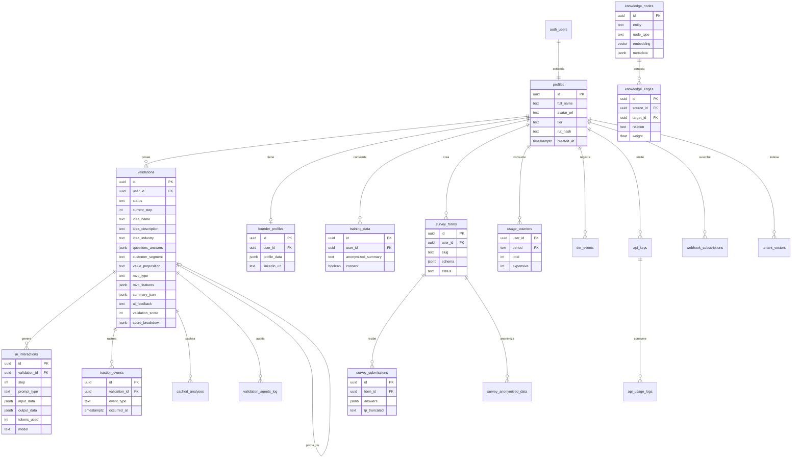

# AI_CONTEXT.md

> Documento maestro de contexto para asistentes de IA.
> Describe el monorepo **`/startups`**, cuyo producto central es **ValidateAI (Validus)**.
> Última actualización: 2026-06-14.

---

## 1. Resumen del Producto

**ValidateAI** (marca comercial **Validus**, prod: `https://validus.scouttech.lat`) es una plataforma **SaaS B2C/B2B** de validación de startups orientada al mercado **chileno y LatAm**. Guía a un emprendedor a través de un wizard de IA de 4 pasos (Idea → Mercado → Fundador → Generación) y produce un **score de validación 0–100** sobre 5 dimensiones (problema, mercado, competencia, solución, ejecución), feedback cualitativo y un conjunto de *deliverables* avanzados (análisis competitivo con RAG, TAM/SAM/SOM, unit economics CAC/LTV, founder-market fit, roadmap MVP tipo Kanban, gobernanza/cap table, roadmap de fundraising, etc.).

La **propuesta de valor** es contextual a Chile: integra datos macro del Banco Central (BCCh), clasificación sectorial INE, registros INAPI (marcas/patentes), datos de ChileCompra, CMF y SII, además de inteligencia de mercado en tiempo real (Reddit, Google Trends vía SerpApi). El modelo de negocio es **freemium por tiers** (`free` / `basic` / `pro` / `premium`) con rate limiting por cuota mensual y monetización vía LemonSqueezy. El mercado objetivo son fundadores en etapa pre-seed/seed, aceleradoras y fondos de VC que necesitan due diligence rápida de calidad institucional.

El monorepo incluye además servicios satélite: un **worker financiero (BralidusPY)** que provee GraphRAG + datos financieros, un **portal de desarrolladores** (RAG-as-a-Service), un **knowledge vault** (corpus de conocimiento metodológico/normativo) y MVPs auxiliares de marketing/data-storytelling.

---

## 2. Stack Tecnológico

### Frontend — `validateai/`
| Categoría | Tecnología | Versión |
|-----------|-----------|---------|
| Lenguaje | TypeScript | ~6.0 |
| Framework UI | React | 19.2 |
| Build / dev | Vite | 8.0 |
| Routing | react-router-dom | 7.14 |
| Estado | Zustand (con `persist`) | 5.0 |
| Estilos | Tailwind CSS v4 + shadcn/ui + tw-animate | 4.2 |
| Formularios | react-hook-form + @hookform/resolvers + Zod | 7.73 / 4.3 |
| Animación | framer-motion | 12.38 |
| 3D | three + @react-three/fiber + drei + d3-geo | 0.184 / 9.6 |
| Gráficos | Recharts, chart.js + react-chartjs-2 | 3.8 / 4.5 |
| Grafos | @xyflow/react + dagre | 12.10 |
| PDF / export | @react-pdf/renderer, jspdf, html-to-docx, jszip | — |
| Drag & drop | @dnd-kit | 6.3 |
| Analytics | posthog-js / posthog-node | 1.37 / 5.35 |
| Errores | @sentry/react | 10.56 |
| Notificaciones | sonner | 2.0 |
| Testing | Vitest + @vitest/coverage-v8, Playwright (E2E) | 4.1 / 1.60 |

### Backend — Supabase Edge Functions (`validateai/supabase/functions/`)
| Categoría | Tecnología |
|-----------|-----------|
| Runtime | **Deno** (Supabase Edge Functions) |
| LLM | Anthropic Claude (default) + OpenAI (fallback), conmutado por `AI_PROVIDER` |
| Auth | Supabase Auth (PKCE), JWT verification por función |
| Pagos | LemonSqueezy (webhook), código Stripe legado |
| Datos externos | BCCh, INE, INAPI, ChileCompra, CMF, SII, FRED, Reddit OAuth, SerpApi, Resend, Fintoc, Figma |

### Base de Datos — Supabase (Postgres)
- **Postgres** con extensiones `uuid-ossp` y `pgvector` (embeddings RAG).
- **RLS** (Row Level Security) en todas las tablas de usuario.
- **RPCs `SECURITY DEFINER`** para operaciones atómicas (ej. `check_and_increment_usage`).
- **pg_cron** para jobs programados (tier-health, UF diaria, follow-up email).
- ~75 migraciones SQL versionadas en `supabase/migrations/`.

### Servicio Financiero — `validateai-financial-worker/` (BralidusPY)
| Categoría | Tecnología |
|-----------|-----------|
| Lenguaje | Python |
| API | FastAPI + uvicorn |
| Scheduler | APScheduler |
| Datos | yfinance + curl_cffi, OpenBB (opcional), feedparser (RSS forense) |
| LLM | OpenAI (embeddings) + Anthropic (Claude Haiku fallback) |
| Infra | Docker + Railway, Supabase como store de vectores/grafo |

### Otros módulos del monorepo
- `validateai-developer-portal/` — frontend (Vite) del portal RAG-as-a-Service.
- `validateai-knowledge-vault/` — vault Obsidian (corpus mercado/metodología/normativa).
- `data-storytelling-mvp/`, `facturaia/`, `pitch/`, `corpus/` — MVPs y assets auxiliares.

---

## 3. Arquitectura del Sistema

ValidateAI sigue un patrón **SPA + BaaS (Backend-as-a-Service) con funciones serverless**: no hay servidor monolítico propio; la lógica de negocio vive entre el cliente React y las Edge Functions de Deno, con Postgres/Supabase como sistema de registro.

```
┌─────────────────────────────────────────────────────────────┐
│  Cliente React 19 SPA (Vite, Vercel)                         │
│  · Wizard 4 pasos → React Hook Form + Zod                    │
│  · Zustand store (persist en localStorage) = fuente verdad UI│
│  · Hooks (useValidation, useAI, useMarketAnalysis, useUsage…)│
└───────────────┬─────────────────────────────────────────────┘
                │ supabase-js (JWT PKCE)
        ┌───────┴────────┐
        ▼                ▼
┌──────────────┐   ┌──────────────────────────────────────────┐
│ Postgres DB  │   │ Supabase Edge Functions (Deno)            │
│ (RLS + RPCs) │◀──│ · ai-validate (18 prompt types, RAG,     │
│              │   │   semantic cache, rate-limit guard)       │
│ · validations│   │ · market-analyze · premium-validate       │
│ · profiles   │   │ · survey-* · extract-founder-profile      │
│ · usage_*    │   │ · lemonsqueezy-webhook · create-checkout  │
│ · knowledge_*│   │ · cron-* · anonymize-idea · followup-email │
└──────────────┘   └───────┬──────────────────────────────────┘
                           │ HTTP / RPC
            ┌──────────────┼───────────────┬─────────────┐
            ▼              ▼               ▼             ▼
      Anthropic/      BralidusPY      APIs Chile     Reddit/
      OpenAI          (FastAPI         (BCCh, INE,   SerpApi/
      (LLM)           GraphRAG)        INAPI, CMF…)  Resend
```

### Patrones de diseño utilizados
- **BaaS serverless**: cliente delgado + Edge Functions stateless; sin capa de servidor propia.
- **Single source of truth en el cliente**: `validationStore` (Zustand + persist) centraliza todo el estado del wizard.
- **RAG (Retrieval-Augmented Generation)**: `ai-validate` recupera competidores/playbooks/knowledge desde tablas con `pgvector` antes de invocar al LLM; BralidusPY añade **GraphRAG** (nodos + aristas en `knowledge_nodes`/`knowledge_edges`).
- **Provider abstraction**: el LLM se conmuta por env var `AI_PROVIDER` (`anthropic` | `openai`) sin tocar el frontend.
- **Semantic caching**: prompts costosos se cachean en `cached_analyses` para ahorrar tokens.
- **Atomic rate limiting**: RPC `check_and_increment_usage` con `SELECT FOR UPDATE` evita race conditions (TOCTOU) en la cuota por tier.
- **RLS multi-tenant**: cada usuario solo ve sus filas; las tablas sensibles (`usage_counters`) solo se acceden vía RPC `SECURITY DEFINER`.
- **Privacy-by-design**: pipeline de anonimización (k-anonymity, l-diversity, t-closeness, ruido Laplace) en `src/lib/privacy/`, RUT hasheado, IP truncada /24, separación de audit logs.
- **Code splitting**: rutas con `React.lazy` + `Suspense`.

### Flujo de datos del wizard
```
Usuario completa paso → RHF + Zod valida
  → useValidation.saveStep() persiste en tabla `validations`
  → callAI() invoca Edge Function `ai-validate`
      → verifica JWT → check_and_increment_usage (rate limit)
      → RAG (si aplica) → Anthropic/OpenAI
      → guarda en `ai_interactions` → devuelve JSON puro
  → validationStore (Zustand) actualiza la UI
```

### Autenticación
Supabase Auth con flujo **PKCE**. `ProtectedLayout` (`src/app/layout.tsx`) protege rutas vía `onAuthStateChange`. Google OAuth aterriza en `/auth/callback` → `AuthCallback.tsx` intercambia el code y hace upsert de la fila `profiles`. Trigger `handle_new_user` crea la fila `profiles` automáticamente en signup.

---

## 4. Modelos de Datos y Entidades

La base de datos extiende `auth.users` (Supabase) con `profiles`. El núcleo del dominio gira en torno a `validations` y sus análisis de IA. A continuación las entidades principales (el esquema completo abarca ~45 tablas; se omiten cachés y tablas de datos externos para legibilidad).



**Tablas adicionales relevantes** (no en el diagrama): `competitors` y `rag_playbooks` (RAG con `pgvector`), `cached_analyses` (semantic cache), `mentors` + embeddings, `market_ine_classifications` / `market_bde_data` / `market_ai_insights` (estudio de mercado), `economic_knowledge`, `sii_empresa_cache`, `chilecompra_metricas`, `pyme_financials`, `bralidus_context_cache`, `consent_logs`, `training_data_audit`, `email_logs`, `email_leads`, `figma_connections`, `content_campaigns`.

---

## 5. Estructura de Directorios Clave

```
startups/                          # Monorepo raíz
├── validateai/                    # ◀── PRODUCTO CENTRAL (React SPA)
│   ├── src/
│   │   ├── app/
│   │   │   ├── layout.tsx         # ProtectedLayout + AppLayout (auth guard, sidebar)
│   │   │   └── routes/            # 30 rutas (páginas). Lógica de pantalla.
│   │   │       ├── Validate.tsx   #   Wizard de validación (entrada principal)
│   │   │       ├── Results.tsx / ValidationDetail.tsx  # Dashboard de resultados
│   │   │       ├── Dashboard.tsx · Pricing.tsx · Admin.tsx
│   │   │       └── Survey*.tsx · Market*.tsx · Developers.tsx
│   │   ├── components/
│   │   │   ├── wizard/            # Pasos del wizard (StepIdea, StepMarket, StepFounder…)
│   │   │   ├── shared/            # Cards de deliverables (Founder, Governance, Unit Eco…)
│   │   │   ├── pdf/               # Plantillas @react-pdf (dossiers, roadmaps)
│   │   │   ├── market/            # Mapa 3D de Chile (Three.js + d3-geo)
│   │   │   ├── developers/ · figma/ · admin/ · dashboard/ · ui/ (shadcn)
│   │   ├── hooks/                 # ◀── LÓGICA DE NEGOCIO en cliente
│   │   │   ├── useValidation.ts   #   CRUD del wizard
│   │   │   ├── useAI.ts           #   invoca edge function ai-validate
│   │   │   ├── useUsage.ts / useUserTier.ts  # rate limit & tiers
│   │   │   └── useMarketAnalysis · useMentors · useValidationHistory …
│   │   ├── stores/                # Zustand: validationStore, carouselStore
│   │   ├── lib/                   # supabase.ts, telemetry.ts, privacy/, hmac, pdf
│   │   ├── types/                 # validation.ts, survey.ts, market.ts, carousel.ts
│   │   └── data/                  # datasets estáticos (corfo, regional, regulatory)
│   └── supabase/
│       ├── functions/            # ◀── BACKEND (Deno Edge Functions, ~40)
│       │   ├── ai-validate/      #   núcleo IA (18 prompt types, RAG, cache)
│       │   ├── premium-validate/ · market-analyze/ · survey-*/
│       │   └── lemonsqueezy-webhook/ · create-checkout/ · cron-*/
│       └── migrations/           # ~75 .sql versionadas (schema + RLS + RPCs)
├── validateai-financial-worker/  # BralidusPY (FastAPI + GraphRAG + finanzas)
├── validateai-developer-portal/  # Portal RAG-as-a-Service (Vite)
├── validateai-knowledge-vault/   # Corpus Obsidian (mercado/metodología/normativa)
├── data-storytelling-mvp/ · facturaia/ · corpus/ · pitch/ · docs/
```

**Dónde vive la lógica:**
- **Reglas de negocio del wizard** → `src/hooks/` + `src/stores/validationStore.ts`.
- **Lógica de IA / prompts** → `supabase/functions/ai-validate/`.
- **Modelo de datos** → `supabase/migrations/`.
- **Rutas de API públicas** → `supabase/functions/api-v1/` (RaaS) y cada edge function es un endpoint.
- **UI de pantallas** → `src/app/routes/`; **componentes reutilizables** → `src/components/`.

---

## 6. Estado Actual del Desarrollo

### ✅ Implementado y funcionando
- **Wizard de validación 4 pasos** con score 5 dimensiones (DNA del producto, estable).
- **`ai-validate`** con 18 prompt types, RAG para análisis competitivo, semantic cache.
- **Rate limiting por tier** (2026-06) — `usage_counters` + RPC atómica `check_and_increment_usage`; `useUsage` + `UsageBar` en sidebar. Límites: free 3/mes, basic 15, pro 50, premium 999.
- **Tiers y gating** (`free/basic/pro/premium`) vía `useUserTier`; **checkout LemonSqueezy** (`create-checkout` + webhook desplegados).
- **Gobernanza + Fundraising**: prompt types `governance_assessment` y `fundraising_roadmap` activos; `GovernanceCard` con cap table visual, checklist INAPI, Ley Karin/21.719.
- **Founder Profile** (Sprint 1.5): migración, `extract-founder-profile`, store, `FounderProfileTab`, inyección en `founder_fit`.
- **Módulo de Encuestas** completo: DB JSONB, 3 edge functions, 4 rutas, bias detector (Mom Test), anonimización (Ley 21.719).
- **Privacy Sprint**: k-anonymity/l-diversity/t-closeness/Laplace en `src/lib/privacy/`, RUT hasheado, IP /24, audit separation, PII shield (3 migraciones en prod).
- **Telemetría**: pipeline PostHog + Zod (micro-feedback, deliverable_viewed, exit-intent, paywall_hit).
- **Onboarding + navegación**: sidebar, AppLayout, dashboard, wizard de onboarding 3 pasos.
- **Inteligencia de mercado Chile**: `market-analyze` (BCCh + INE), mapa 3D de regiones, widgets de market signals (Bralidus).
- **BralidusPY**: FastAPI + GraphRAG dinámico (25 industrias, 305 aristas), GRAPH+VECTOR funcional.
- **Control de acceso Demo 100** (épica en main): cuentas demo seed + RLS sellado en prod.
- **CI Frontend**: `frontend-ci.yml` con gates duros (tsc/vitest/build) + smoke E2E Playwright.
- **Command Center UX**: soft paywall `/demo` (email_leads), asincronía híbrida (free→dashboard, premium in-place).

### ⚠️ En construcción / parcial
- **Inteligencia premium real**: `premium-validate` aún usa mocks (`fetchRedditMock`/`fetchTrendsMock`) si faltan `REDDIT_*`/`SERPAPI_KEY`; `EvidenceWall` puede mostrar datos fake. **Mayor gap de la propuesta premium.**
- **Integración Bralidus → Validación**: plan aprobado, Fase 0+1; `ai-validate` aún NO usa Bralidus; DD usa `/query` antiguo sin procedencia; no desplegado en prod (Gap D).
- **Emails transaccionales (Resend)**: `followup-email` existe pero **en DRY RUN**, bloqueado hasta DNS de `scouttech.lat`.
- **INAPI Fase 2**: migrar `inapi_records` (~1.28 GB) al knowledge-vault separado (Fase 1 ya ejecutada).
- **LinkedIn OAuth**: Sprint 1.5-B **bloqueado** hasta crear LinkedIn Company Page.
- **Generación**: aún síncrona (bloquea UI en prompts largos); job sigue client-side (deuda técnica conocida).
- **RaaS (developer portal)**: `api-v1`, `api_keys`, `tenant_vectors`, `webhook_subscriptions` existen; maduración en curso.

### ❌ Deuda / pendiente conocido
- `idea_name` / `idea_industry` pueden ser `null` si se abandona el paso 1.
- Cobertura de tests creciendo pero parcial (lint advisory por deuda preexistente).
- Vercel Previews (Escalón 2 de CI) en HOLD.
- yfinance en Bralidus con rate limit pendiente de mitigar.

---

> **Notas para el asistente de IA**: el score de 5 dimensiones (problem/market/competition/solution/execution) **no debe modificarse** — es el DNA del producto. Antes de proponer features medianas/grandes, aplicar el *Friction Check* (técnica/UX/costo) y anclar cada feature a un KPI de negocio (ver `validateai/CLAUDE.md`). Todas las respuestas de las edge functions deben ser **JSON puro**.
