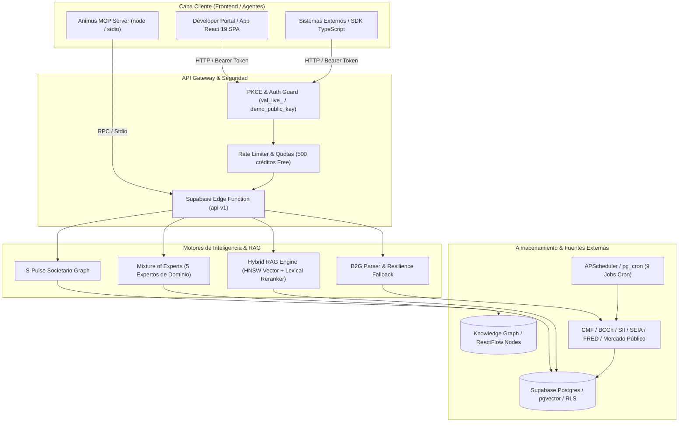

# Animus Engine v2.0 / Bralidus RaaS — Especificación Global para Frontend

> **Documento Maestro de Reconocimiento Global y Especificación Técnica**  
> **Objetivo:** Proporcionar al equipo de desarrollo Frontend la arquitectura, especificaciones de autenticación, catálogo exhaustivo de endpoints, estructuras de datos JSON, contratos de API y mejores prácticas para la integración y construcción de interfaces UI/UX con **Animus Engine v2.0 / Bralidus RaaS**.  
> **Fecha de Especificación:** Julio 2026

---

## 1. Visión Global: ¿Qué es Animus Engine / Bralidus RaaS?

**Animus Engine v2.0** (integrado con **Bralidus RaaS**) es el motor central de **Inteligencia, Recuperación Documental y Analítica Normativo-Financiera (Retrieval-as-a-Service)** de la plataforma. Diseñado con una arquitectura API-First y LLM-First, permite a interfaces web (SPA), aplicaciones satélite e IDEs agénticos (a través del **Model Context Protocol - MCP**) consultar de forma unificada:

1. **Mercado Público (B2G / ChileCompra):** Búsqueda unificada de licitaciones públicas (LE/LP), Compras Ágiles (< 300 UTM), órdenes de compra adjudicadas, perfilamiento de proveedores del Estado y benchmarks sectoriales en tiempo real.
2. **Inteligencia Macroeconómica & Financiera:** Series temporales de indicadores de Chile (UF, UTM, TPM, IPC, Dólar, Euro, Cobre, Imacec), datos de empleo INE, boletines concursales (reorganizaciones y liquidaciones), y fuentes federales de Estados Unidos (FRED).
3. **GraphRAG & Mixture of Experts (MoE 5 Expertos):** Enrutamiento inteligente de consultas en lenguaje natural a través de 5 expertos de dominio (*Macro*, *Mercados*, *Unit Economics*, *Legal Normativo*, y *Estrategia B2G*) combinando grafos de conocimiento multidominio con citas verificables (SHA-256).
4. **RAG Vectorial & Vaults Privados:** Ingesta documental multipart (PDF, DOCX, TXT) o texto plano, división en fragmentos (*chunking* semántico), almacenamiento vectorial en `pgvector` y búsqueda híbrida (HNSW + coincidencia léxica con *reranking*).
5. **Grafo Societario y Mallas (S-Pulse):** Redes societarias 360°, participación accionaria, representantes legales, sociedades relacionadas y detección de conflictos de interés B2G.



---

## 2. Convenciones Base y Autenticación para el Frontend

### 2.1 URL Base del API Gateway
El Frontend debe utilizar una variable de entorno para conmutar entre el servidor de desarrollo local (a través del proxy de Vite) y producción en Supabase Edge Functions:

- **Producción (Supabase Gateway):** `https://fcdhcntyvsydnvjwopfe.supabase.co/functions/v1/api-v1`
- **Desarrollo Local (Vite Proxy):** `/supabase-api/api-v1`

```typescript
// Configuración de la URL base en el cliente API del Frontend
const isLocal = typeof window !== 'undefined' && 
  (window.location.hostname === 'localhost' || window.location.hostname === '127.0.0.1');

export const API_BASE_URL = isLocal
  ? '/supabase-api/api-v1'
  : 'https://fcdhcntyvsydnvjwopfe.supabase.co/functions/v1/api-v1';
```

### 2.2 Autenticación vía API Key
Todas las peticiones HTTP (salvo endpoints públicos de `health` y señales en vivo) deben incluir la cabecera `Authorization: Bearer <API_KEY>`.

- **Formato de API Key:** `val_live_<16_bytes_hex_aleatorios>`
- **Llave de Prueba / Playground:** `demo_public_key` (permite realizar pruebas en tiempo real con rate limits acotados al tier Free).
- **Seguridad en Frontend:** El raw de la API Key no debe persistirse en logs ni exponerse al exterior; en la base de datos solo se conserva el hash SHA-256.

```http
GET /api/v1/mercado-publico/licitaciones?estado=publicada HTTP/1.1
Host: fcdhcntyvsydnvjwopfe.supabase.co
Authorization: Bearer demo_public_key
Content-Type: application/json
```

### 2.3 Estructura Estándar de Respuesta JSON
El contrato API garantiza que las respuestas exitosas envuelvan su contenido en un atributo `data` (con un opcional `meta` para paginación) o entreguen el objeto consolidado:

```json
{
  "data": [
    {
      "id": "item_1",
      "title": "Adquisición de Equipos de Conectividad"
    }
  ],
  "meta": {
    "page": 1,
    "page_size": 20,
    "total": 142
  }
}
```

### 2.4 Códigos HTTP de Error Estándar
El Frontend debe estar preparado para gestionar de forma explícita los siguientes códigos HTTP:
- `400 Bad Request`: Parámetros o cuerpo de petición inválidos (ej. formato de RUT erróneo, JSON malformado).
- `401 Unauthorized`: API Key faltante, inválida o revocada.
- `404 Not Found`: Recurso no encontrado (ej. licitación o RUT inexistente).
- `429 Too Many Requests`: Cuota mensual agotada o límite de ráfaga (rate limit) excedido en el tier actual.
- `503 Service Unavailable`: Servicio dependiente temporalmente inhabilitado o en mantenimiento.

### 2.5 Resiliencia Frontend: Capa de Fallback B2G y Alertas de Actualización
1. **Fallback de ChileCompra (`Resiliencia B2G`):** Si un endpoint de Mercado Público devuelve un estado de indisponibilidad temporal de la fuente estatal, el Frontend del Developer Portal activa automáticamente un *fallback* inyectando 12 procesos reales de instituciones públicas chilenas en CLP/UTM con enlaces oficiales para mantener la usabilidad.
2. **Toast de Notificación SPA (`VersionUpdateAlert`):** La SPA cuenta con detección automática de nuevas versiones emitidas en el servidor. Al detectarse, activa una recarga limpia que invalida la caché local (`cache-buster`) sin requerir acción manual del usuario.

---

## 3. Catálogo de Tiers y Límites de Consumo (Quotas)

El sistema opera con 4 niveles de suscripción administrados por la Edge Function e inspeccionables mediante `/api/v1/health/services`:

| Tier | Créditos Mensuales | Ráfaga Máxima | Soporte de Endpoints | Uso Recomendado |
|:---|:---:|:---:|:---|:---|
| **Free / Trial** | `500 créditos` | `30 req/min` | Todos (modo lectura + RAG básico) | Validación, playgrounds y pruebas frontend. |
| **Starter** | `5,000 créditos` | `60 req/min` | Todos + exportaciones CSV/JSON | MVP y pequeños desarrollos B2G. |
| **Pro** | `25,000 créditos` | `120 req/min` | Todos + GraphRAG MoE completo + Webhooks | Aplicaciones en producción y análisis masivo. |
| **Enterprise** | `Ilimitado / Custom` | `600+ req/min` | Vaults dedicados + S-Pulse ilimitado | Agencias e Instituciones del Estado. |

---

## 4. Especificación Completa de Secciones y Endpoints (API Reference)

A continuación se detalla cada sección del sistema **Animus**, junto a su **Color Token de UI** (recomendado para renderizar insignias, pestañas o separadores visuales en el Frontend) y sus endpoints canónicos.

---

### 4.1 Sección 1: Mercado Público (B2G / ChileCompra)
- **Color Token UI:** `#F59E0B` (Ámbar / Warning)
- **Propósito:** Consulta en tiempo real de licitaciones públicas, compras ágiles, órdenes de compra, perfiles y benchmarks del sistema nacional de compras estatales.

| Método | Endpoint | Descripción | Parámetros Principales |
|:---:|:---|:---|:---|
| `GET` | `/api/v1/mercado-publico/health` | Estado operativo de servicios V1 y Compra Ágil V2. | — |
| `GET` | `/api/v1/mercado-publico/opportunities` | Buscador Unificado (licitaciones + compra ágil). | `q`, `type` (`tender`\|`agile_purchase`), `status`, `page`, `page_size` |
| `GET` | `/api/v1/mercado-publico/licitaciones` | Listado paginado de licitaciones públicas. | `fecha_inicio`, `fecha_fin`, `estado`, `codigo_organismo`, `q`, `page`, `page_size` |
| `GET` | `/api/v1/mercado-publico/licitaciones/:id` | Detalle completo de licitación con ítems y adjuntos. | `codigo_externo` (`id`, ej: `1234-56-LE26`) |
| `GET` | `/api/v1/mercado-publico/compra-agil` | Oportunidades en tiempo real (< 300 UTM). | `buyer_rut`, `q`, `page` |
| `GET` | `/api/v1/mercado-publico/ordenes-compra` | Listado de OCs emitidas por organismos del Estado. | `fecha`, `rut_proveedor`, `estado`, `codigo_organismo` |
| `GET` | `/api/v1/mercado-publico/ordenes-compra/:id` | Detalle completo de orden de compra (precios/ítems). | `codigo_oc` (ej: `1234-56-SE26`) |
| `GET` | `/api/v1/mercado-publico/proveedores/:rut` | Perfil B2G integral del proveedor (licitaciones/OCs). | `rut` (ej: `76086428-5`) |
| `GET` | `/api/v1/mercado-publico/benchmarks` | Indicadores de referencia y competitividad sectorial. | `sector`, `anio` |

#### Ejemplo de Respuesta (`/api/v1/mercado-publico/licitaciones`):
```json
{
  "data": [
    {
      "id": "lic_9921",
      "external_code": "1234-56-LE26",
      "title": "Servicio de Mantenimiento de Infraestructura TI",
      "status_code": "publicada",
      "buyer_name": "Ministerio de Educación",
      "closing_date": "2026-08-15T16:00:00Z"
    }
  ],
  "meta": { "page": 1, "page_size": 20, "total": 142 }
}
```

---

### 4.2 Sección 2: Datos Económicos & Macro
- **Color Token UI:** `#2DD4BF` (Turquesa / Teal)
- **Propósito:** Snapshot de indicadores chilenos, mercado laboral, proyectos de inversión y alertas concursales.

| Método | Endpoint | Descripción | Parámetros Principales |
|:---:|:---|:---|:---|
| `GET` | `/api/v1/data/economy` | Snapshot Macroeconómico de Chile (UF, UTM, TPM, IPC, Dólar, Euro, Cobre). | — |
| `GET` | `/api/v1/data/macro` | Indicadores Globales FRED y series normalizadas. | — |
| `GET` | `/api/v1/data/labor` | Snapshot del mercado laboral chileno. | — |
| `GET` | `/api/v1/data/labor/unemployment` | Tasa de desocupación INE nacional y por regiones. | — |
| `GET` | `/api/v1/data/labor/wages` | Índice de Remuneraciones (IR Real) e Índice ICMO. | — |
| `GET` | `/api/v1/data/investment-projects` | Pipeline de Proyectos de Inversión SEIA ($ CapEx). | — |
| `GET` | `/api/v1/data/company-events/constitutions` | Nuevas constituciones de sociedades en Diario Oficial. | — |
| `GET` | `/api/v1/data/analytics/correlations` | Matriz de correlación cruzada en tiempo real. | — |
| `POST` | `/api/v1/data/insights/macro-brief` | Informe de síntesis macroeconómica generado por IA. | — |
| `POST` | `/api/v1/data/insights/scenario-analysis` | Simulación generativa de escenarios macro por IA. | `scenario` (`object`: variaciones %) |
| `POST` | `/api/v1/data/exports` | Exportación masiva asíncrona de datos. | `format` (`json`\|`csv`\|`parquet`) |
| `GET` | `/api/v1/data/companies/insolvencies` | Boletín Concursal: reorganizaciones y liquidaciones. | — |
| `GET` | `/api/v1/data/companies/:rut/insolvency-status` | Radar Concursal: estado concursal por RUT. | `rut` |

#### Ejemplo de Respuesta (`/api/v1/data/economy`):
```json
{
  "data": {
    "uf_clp": 38450.22,
    "utm_clp": 67810.00,
    "tpm_pct": 5.25,
    "usd_clp": 948.50,
    "copper_usd_lb": 4.28,
    "updated_at": "2026-07-29T12:00:00Z"
  }
}
```

---

### 4.3 Sección 3: Animus Intelligence & GraphRAG (MoE 5 Expertos)
- **Color Token UI:** `#8B5CF6` (Púrpura / Violeta)
- **Propósito:** Enrutamiento inteligente multidominio entre 5 expertos (*Macro, Markets, Unit Economics, Legal, Estrategia B2G*), evaluaciones deterministas de compatibilidad/riesgo y generación de informes de inteligencia.

| Método | Endpoint | Descripción | Parámetros Principales |
|:---:|:---|:---|:---|
| `POST` | `/api/v1/intel/query` | Consulta Inteligente Unificada Animus con enrutamiento automático entre los 5 expertos. | `query`, `routing` (`auto`\|`manual`), `context` (`object`) |
| `POST` | `/api/v1/intel/query/moe` | Consulta directa al motor Mixture of Experts (MoE). | `query`, `max_experts` |
| `GET` | `/api/v1/intel/experts` | Catálogo de los 5 expertos, capacidades y fuentes. | — |
| `POST` | `/api/v1/intel/experts/:id/query` | Consulta dirigida en exclusiva a un experto específico. | `id`, `query` |
| `POST` | `/api/v1/intel/assessments/tender-fit` | Evaluación determinista de fit (0-100 pts) con licitación. | `company` (`{rut}`), `tender` (`{code}`) |
| `POST` | `/api/v1/intel/assessments/company-risk` | Evaluación de riesgo concursal, legal y de crédito. | `company_rut` |
| `POST` | `/api/v1/intel/assessments/macro-impact` | Evaluación de impacto macroeconómico en modelo B2G. | `inputs` (`{sector, currency_exposure}`) |
| `POST` | `/api/v1/intel/assessments/win-probability` | Estimación de Win Probability % vs mediana histórica. | `offer_clp` |
| `POST` | `/api/v1/intel/assessments/buyer-profile` | Perfil 360° del comprador: días pago, Ley 30 días, reclamos. | `buyer_rut` |
| `POST` | `/api/v1/intel/assessments/legal-basis` | Fundamentación legal aplicable (Ley 19.886, etc.). | — |
| `POST` | `/api/v1/intel/assessments/regulatory-compliance` | Matriz de cumplimiento Ley Fintec 21.521 / Datos 21.719. | — |
| `POST` | `/api/v1/intel/reports` | Generación asíncrona de informe ejecutivo (MD/PDF). | `report_type`, `title` |
| `GET` | `/api/v1/intel/jobs/:id` | Consulta de estado del informe asíncrono. | `id` |
| `GET` | `/api/v1/intel/citations/:id` | Trazabilidad y verificación SHA-256 de una cita de IA. | `id` |
| `GET` | `/api/v1/intel/graph/entities` | Buscador de entidades en el Grafo Multidominio. | `q` |
| `GET` | `/api/v1/intel/graph/entities/:id/neighbors` | Vecinos directos y aristas relacionales del nodo. | `id` |
| `POST` | `/api/v1/intel/sessions` | Crea sesión conversacional con retención de contexto. | `name` |
| `POST` | `/api/v1/intel/sessions/:id/messages` | Envía mensaje al hilo conversacional. | `id`, `message` |
| `POST` | `/api/v1/intel/estimate` | Estimador previo de créditos y latencia esperada. | `operation` |

#### Ejemplo de Respuesta (`/api/v1/intel/assessments/tender-fit`):
```json
{
  "data": {
    "fit_score": 88,
    "recommendation": "HIGH_FIT_RECOMMENDED",
    "dimensions": {
      "technical_fit": 92,
      "financial_capacity": 85,
      "experience_match": 88
    },
    "key_advantages": [
      "Cumplimiento 100% de requisitos de boleta de garantía.",
      "Historial de 4 adjudicaciones previas con el organismo."
    ]
  }
}
```

---

### 4.4 Sección 4: RAG & Vault Vectorial (`pgvector`)
- **Color Token UI:** `#0EB5C6` (Cyan / Azul Claro)
- **Propósito:** Gestión de contenedores privados de documentos (*Vaults*), colecciones, ingesta de archivos, división semántica (*chunks*) y búsqueda híbrida (HNSW + léxica con *reranking*).

| Método | Endpoint | Descripción | Parámetros Principales |
|:---:|:---|:---|:---|
| `POST` | `/api/v1/rag/query` | Búsqueda híbrida de evidencia (HNSW + léxica + rerank). | `query`, `scope` (`vault_ids`, `collection_ids`), `search` |
| `POST` | `/api/v1/rag/vaults` | Crea un contenedor de seguridad documental (Vault). | `name`, `settings` |
| `GET` | `/api/v1/rag/vaults` | Listado de Vaults accesibles en el workspace. | — |
| `GET` | `/api/v1/rag/vaults/:id/stats` | Estadísticas del Vault: documentos, chunks y almacenamiento. | `id` |
| `POST` | `/api/v1/rag/vaults/:id/collections` | Crea una colección lógica de documentos dentro de un Vault. | `id`, `name` |
| `POST` | `/api/v1/rag/documents/text` | Ingesta directa de texto plano con chunking semántico. | `vault_id`, `title`, `content` |
| `POST` | `/api/v1/rag/documents/file` | Carga multipart/form-data de archivos (PDF, DOCX, TXT). | `file` (`FormData`), `vault_id` |
| `POST` | `/api/v1/rag/uploads` | Genera URL firmada presigned de carga directa grandes archivos. | `filename` |
| `POST` | `/api/v1/rag/batches` | Ingesta masiva asíncrona batch de documentos. | `vault_id`, `documents` |
| `GET` | `/api/v1/rag/documents` | Listado y búsqueda de documentos indexados. | `vault_id` |
| `DELETE` | `/api/v1/rag/documents/:id` | Purga segura del documento, sus versiones y vectores. | `id` |
| `GET` | `/api/v1/rag/documents/:id/chunks` | Inspección de fragmentos vectorizados y sus páginas. | `id` |
| `POST` | `/api/v1/rag/context` | Genera Context Packs optimizados para LLMs con presupuesto de tokens. | `query`, `budget` (`{max_tokens}`) |

#### Ejemplo de Respuesta (`/api/v1/rag/query`):
```json
{
  "data": {
    "query_id": "qry_01K8...",
    "results": [
      {
        "rank": 1,
        "chunk_id": "chk_8832",
        "document_title": "Bases de Licitación Tecnológica 2026.pdf",
        "location": { "page": 14, "section": "4.2 Garantías de Seriedad" },
        "content_snippet": "La boleta de garantía de seriedad de la oferta deberá ser emitida...",
        "scores": { "vector": 0.88, "lexical": 0.79, "reranker": 0.94, "final": 0.91 }
      }
    ]
  }
}
```

---

### 4.5 Sección 5: Grafo Societario y Mallas (S-Pulse)
- **Color Token UI:** `#3B82F6` (Azul / Blue)
- **Propósito:** Inspección de redes de propiedad, composición de accionistas, representantes legales y análisis forense societario por RUT en Chile.

| Método | Endpoint | Descripción | Parámetros Principales |
|:---:|:---|:---|:---|
| `GET` | `/api/v1/data/spulse/companies/search` | Buscador de empresas por RUT o razón social. | `q` |
| `GET` | `/api/v1/data/spulse/companies/:rut/profile` | Ficha 360° societaria (socios, participación, directiva). | `rut` (ej: `76123456K`) |
| `GET` | `/api/v1/data/spulse/companies/:rut/network` | Grafo de nodos y aristas para renderizado de malla societaria. | `rut` |
| `GET` | `/api/v1/data/spulse/relationships/:id/source` | Trazabilidad legal: extracto Diario Oficial / escritura. | `id` |
| `GET` | `/api/v1/data/companies/:rut/economic-profile` | Perfil unificado de empresa (salud, riesgo, B2G). | `rut` |
| `POST` | `/api/v1/data/companies/:rut/b2g-conflicts` | Detector de conflictos de interés B2G y cruce de socios. | `rut` |
| `GET` | `/api/v1/data/companies/:rut/related-parties` | Red de sociedades relacionadas (matrices y filiales). | `rut` |

#### Ejemplo de Respuesta (`/api/v1/data/spulse/companies/:rut/network`):
```json
{
  "data": {
    "nodes": [
      { "id": "rut_empresa", "label": "Electromedicina Chile SpA", "type": "company", "capital_clp": 150000000 },
      { "id": "rut_socio", "label": "Luciano Larraín", "type": "person", "share_pct": 60.0 }
    ],
    "edges": [
      { "source": "rut_socio", "target": "rut_empresa", "label": "shareholder", "weight": 60.0 }
    ]
  }
}
```

---

### 4.6 Sección 6: Webhooks, Alertas y MegaPrompt Wizard
- **Color Token UI:** `#10B981` (Esmeralda / Green)
- **Propósito:** Ejecución de validaciones globales e inscripción de webhooks para notificaciones asíncronas de eventos.

| Método | Endpoint | Descripción | Parámetros Principales |
|:---:|:---|:---|:---|
| `POST` | `/api/v1/validate` | Wizard MegaPrompt: análisis integral de startup (Score 0-100 + 18 entregables). | `startup_profile` (`object`) |
| `POST` | `/api/v1/webhooks` | Registro de URL HTTPS para alertas asíncronas en tiempo real. | `url`, `event` (`radar.signal`\|`tender.published`\|`po.created`) |
| `GET` | `/api/v1/health/services` | Health check general de microservicios, bases y workers. | — |

---

### 4.7 Sección 7: Protocolo MCP Server para Agentes (`animus-engine-mcp`)
- **Color Token UI:** `#8B5CF6` (Púrpura / Violeta)
- **Propósito:** Acceso agéntico por Model Context Protocol (MCP) para que asistentes IA (Claude Desktop, Antigravity, Cursor IDE) consulten y ejecuten herramientas sobre el sistema de forma nativa.

| Método | Endpoint | Descripción | Parámetros Principales |
|:---:|:---|:---|:---|
| `POST` | `/mcp/v1/tools/call` | Ejecución remota de herramienta MCP sobre la infraestructura Animus. | `name` (`string`), `arguments` (`object`) |

#### Herramientas MCP Registradas en el Servidor (`animus-engine-mcp`):
1. `animus_intel_query`: Consulta al Grafo de Conocimiento MoE en lenguaje natural.
2. `animus_rag_search`: Búsqueda semántica (Vector RAG) sobre regulación chilena (Ley Fintec 21.521, etc.).
3. `animus_economic_macro`: Indicadores macroeconómicos chilenos normalizados (UF, UTM, TPM, Dólar, Cobre).
4. `animus_economic_catalog`: Catálogo completo de series en la base de datos multi-proveedor.
5. `animus_licitus_activas`: Licitaciones públicas B2G abiertas en tiempo real en Mercado Público.
6. `animus_licitus_compra_agil`: Oportunidades en tiempo real de Compras Ágiles (< 300 UTM).

---

## 5. Guía de Consumo e Implementación Frontend (`TypeScript / Hooks`)

### 5.1 Cliente API Universal TypeScript para el Frontend
Se recomienda encapsular las peticiones HTTP en un cliente tipado para estandarizar el manejo de cabeceras de autorización y errores HTTP:

```typescript
// src/lib/animusClient.ts
import { API_BASE_URL } from './config';

export interface AnimusResponse<T> {
  data: T;
  meta?: {
    page: number;
    page_size: number;
    total: number;
  };
}

export class AnimusApiError extends Error {
  constructor(public status: number, public message: string) {
    super(message);
  }
}

export async function animusFetch<T>(
  endpoint: string,
  options: RequestInit = {},
  apiKey: string = 'demo_public_key'
): Promise<AnimusResponse<T>> {
  const url = `${API_BASE_URL}${endpoint.startsWith('/') ? endpoint : `/${endpoint}`}`;
  
  const headers = new Headers(options.headers || {});
  headers.set('Authorization', `Bearer ${apiKey}`);
  if (!headers.has('Content-Type') && !(options.body instanceof FormData)) {
    headers.set('Content-Type', 'application/json');
  }

  const response = await fetch(url, {
    ...options,
    headers,
  });

  if (!response.ok) {
    let errorMsg = `Error HTTP ${response.status}`;
    try {
      const errJson = await response.json();
      if (errJson.error) errorMsg = errJson.error;
    } catch {}
    throw new AnimusApiError(response.status, errorMsg);
  }

  return await response.json();
}
```

### 5.2 Ejemplo de Hook Custom en React (`useAnimusTenders`)
Ejemplo de cómo construir un custom hook que consulte licitaciones públicas de Mercado Público e integre gestión de estado, carga y errores:

```typescript
// src/hooks/useAnimusTenders.ts
import { useState, useEffect } from 'react';
import { animusFetch, AnimusResponse, AnimusApiError } from '@/lib/animusClient';

export interface TenderItem {
  id: string;
  external_code: string;
  title: string;
  status_code: string;
  buyer_name: string;
  closing_date: string;
}

export function useAnimusTenders(status: string = 'publicada') {
  const [data, setData] = useState<TenderItem[]>([]);
  const [loading, setLoading] = useState<boolean>(true);
  const [error, setError] = useState<string | null>(null);

  useEffect(() => {
    let isMounted = true;
    const fetchTenders = async () => {
      setLoading(true);
      setError(null);
      try {
        const res = await animusFetch<TenderItem[]>(`/mercado-publico/licitaciones?estado=${encodeURIComponent(status)}`);
        if (isMounted) {
          setData(res.data);
        }
      } catch (err) {
        if (isMounted) {
          setError(err instanceof AnimusApiError ? err.message : 'Error desconocido al cargar licitaciones');
        }
      } finally {
        if (isMounted) setLoading(false);
      }
    };

    fetchTenders();
    return () => { isMounted = false; };
  }, [status]);

  return { data, loading, error };
}
```

### 5.3 Paleta de Colores por Sección para UI/UX Frontend
Para mantener consistencia visual al diseñar componentes, pestañas (*tabs*), tablas y tarjetas (*cards*), el Frontend debe aplicar el sistema cromático de las 7 secciones:

```css
/* Tokens sugeridos para index.css / tailwind */
:root {
  --color-b2g: #F59E0B;          /* Mercado Público B2G (Ámbar) */
  --color-macro: #2DD4BF;        /* Datos Económicos & Macro (Turquesa) */
  --color-intel: #8B5CF6;        /* Animus Intelligence & MCP (Violeta) */
  --color-rag: #0EB5C6;          /* RAG Vectorial & Vaults (Cyan) */
  --color-spulse: #3B82F6;       /* Grafo Societario S-Pulse (Azul) */
  --color-webhooks: #10B981;     /* Webhooks & Alertas (Esmeralda) */
}
```

### 5.4 Librerías UI Recomendadas para Visualización en Frontend
1. **Grafo Societario y Mallas (`S-Pulse` / `Knowledge Graph`):**
   - Utilizar **ReactFlow (`@xyflow/react`)** junto al motor de disposición **Dagre** para graficar automáticamente nodos y aristas devueltos por `/api/v1/data/spulse/companies/:rut/network` y `/api/v1/intel/graph/entities/:id/neighbors`.
2. **Gráficos de Series Macroeconómicas (`FRED`, `CMF`, `BCCh`):**
   - Utilizar **Recharts 3** (`ResponsiveContainer`, `AreaChart`, `BarChart`, `Tooltip`) para series del dólar, cobre y tasas TPM devueltas por `/api/v1/data/economy`.
3. **Renderizado de Informes y Citas de IA (`GraphRAG MD`):**
   - Utilizar **`react-markdown`** junto con soporte de tablas para presentar los informes generados por `/api/v1/intel/reports/:id`, enlazando las citas del atributo `citations` directamente al modal de verificación `/api/v1/intel/citations/:id`.

---

*Especificación Técnica Animus Engine v2.0 / Bralidus RaaS — Diseñado para Integración Frontend API-First.*
