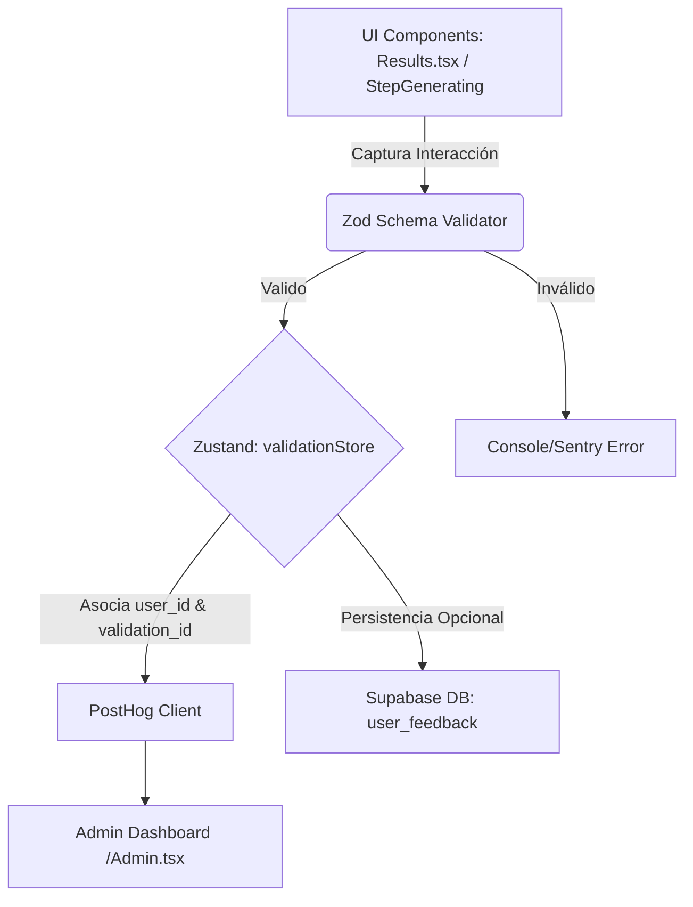

### 1. Resumen Ejecutivo

Implementación de un pipeline de telemetría y retroalimentación comportamental integrado nativamente en el Wizard de Validus. La solución utilizará PostHog para el tracking de eventos, Zod para la validación estricta de esquemas de datos, y Zustand (`validationStore`) para el manejo del estado, recolectando micro-feedback (basado en *The Mom Test*) de forma no intrusiva en `StepGenerating` y `Results.tsx` para guiar el product-market fit con evidencia, no con opiniones.

---

### 2. Análisis por Agentes

#### 👨‍💼 Product Owner (PO): Valor y Negocio

**Objetivo de Negocio:** Eliminar las suposiciones ("vanity metrics") y basar el roadmap del producto en interacciones y comportamientos reales de los usuarios, midiendo el valor tangible de los entregables y los puntos exactos de fricción.
**Usuario Objetivo:** Emprendedores y startups utilizando el Wizard de validación, y el equipo interno (Admin) consumiendo los datos.

**Backlog de Historias de Usuario (MoSCoW):**

| Épica | Prioridad | Historia de Usuario (Como / Quiero / Para) | Criterios de Aceptación (DoD) |
| --- | --- | --- | --- |
| **Telemetry** | Must | **Como** PO, **quiero** capturar un evento estructurado cuando se genera un entregable **para** medir la utilidad real de la IA. | 1. Trigger `deliverable_viewed` enviado a PostHog. 2. Incluye `user_id`, `validation_id` y `plan_type`. |
| **Feedback** | Must | **Como** PO, **quiero** recopilar micro-feedback comportamental en `Results.tsx` **para** saber qué acción tomó el usuario tras leer el reporte. | 1. Pregunta basada en Mom Test (ej. "¿Qué dato del reporte usarás en tu próximo pitch?"). 2. Feedback validado vía Zod antes de enviarse. |
| **Friction** | Must | **Como** PO, **quiero** forzar una selección rápida de motivo de abandono al salir del Wizard **para** entender bloqueos reales. | 1. Interceptar intento de salida/cierre. 2. Opción de 1 clic (ej. "Me faltan datos financieros"). 3. Dispara evento `wizard_abandoned`. |
| **Monetization** | Should | **Como** PO, **quiero** registrar intentos de acceso a funciones Pro **para** medir la elasticidad del paywall. | 1. Evento `paywall_hit` incluye el `feature_name` intentado y el `current_tier`. |

#### 📅 Project Manager / Scrum Master (PM): Ejecución y Tiempos

**Roadmap Sugerido (Sprint de 2 Semanas):**

* **Fase 1: Configuración Core (Días 1-3):** Definición de esquemas Zod en el frontend, actualización del `validationStore` e instanciación del cliente de PostHog.
* **Fase 2: Instrumentación de UI (Días 4-7):** Integración de trackers y micro-componentes de feedback en `StepGenerating.tsx`, `Results.tsx` y el Paywall.
* **Fase 3: Exit Intent & Dashboards (Días 8-10):** Captura de `beforeunload` para abandono del funnel y armado del Dashboard de correlación en `/Admin.tsx`.

**Matriz de Riesgos:**

* *Riesgo:* Bloqueadores de navegadores (AdBlockers/Brave) bloqueando PostHog. *Mitigación:* Usar un proxy inverso (Edge Function) para PostHog si la pérdida de eventos supera el 15%.
* *Riesgo:* Fricción excesiva en el Exit-Intent. *Mitigación:* Hacer que la encuesta de salida sea de un solo clic y asíncrona.

#### 💻 Tech Lead: Viabilidad y Arquitectura

**Stack Recomendado:** React 19, Zustand, Zod, PostHog (JS library), Supabase (Base de datos / Auth).

**Arquitectura de Datos y Eventos:**
Para mantener la base de datos libre de "basura", el feedback pasará por una capa estricta de validación en cliente antes de despacharse.



**Esquemas Zod Propuestos (Typescript):**

```typescript
const FeedbackEventSchema = z.object({
  event_name: z.enum(['deliverable_viewed', 'wizard_abandoned', 'paywall_hit', 'micro_feedback']),
  user_id: z.string().uuid(),
  validation_id: z.string().uuid().optional(),
  context: z.object({
    tier: z.enum(['free', 'basic', 'pro', 'premium']),
    action_taken: z.string().min(3), // Basado en comportamiento
    step_reached: z.number().min(1).max(4).optional()
  })
});

```

#### 🎨 UX/UI Designer: Experiencia de Usuario

El diseño debe evitar ser un obstáculo. "Sutil pero efectivo".

* **Micro-Feedback en `StepGenerating`:** Mientras el usuario espera (la IA puede tardar unos segundos), aprovechar el componente de "carga" para mostrar una pregunta de selección múltiple sobre *comportamiento pasado* (Ej: "¿Cómo validabas ideas antes de usar esta herramienta?").
* **Reportes en `Results.tsx`:** Al final del Pitch Deck o reporte, incrustar un panel nativo (no modal) que diga: *"Para refinar nuestro RAG: ¿Tuviste que corregir algún dato de este reporte? [Sí, la TAM] [Sí, los competidores] [Estaba listo para usar]"*.
* **Exit-Intent:** Si el cursor sale del viewport del navegador y el `currentStep` < 4, mostrar un mini-dialog: *"Guardamos tu progreso. ¿Te faltó información para continuar? [Sí, me faltan datos] [Solo estaba explorando]"*.

#### ⚙️ QA Engineer: Calidad y Pruebas

**Definition of Done (DoD):** El evento aparece en el dashboard de PostHog con el payload estructuralmente perfecto según el esquema Zod.

| ID | Tipo | Caso de Prueba | Resultado Esperado |
| --- | --- | --- | --- |
| **TC01** | Positivo | Usuario visualiza el reporte completo en `Results.tsx`. | Se despacha `deliverable_viewed` a PostHog con el timestamp y UUIDs correctos. |
| **TC02** | Negativo | Intento de enviar feedback con un payload vacío o manipulado. | Zod intercepta el error; no se envía a PostHog. Falla silenciosa en UI. |
| **TC03** | Borde | Usuario cierra abruptamente la pestaña (Cmd+W / Ctrl+W) en el paso 2. | El listener `beforeunload` logra capturar el estado final en `validationStore` y emite `wizard_abandoned` con `step_reached: 2` de forma asíncrona (usando `navigator.sendBeacon` o similar). |
| **TC04** | Integración | Usuario Free intenta hacer clic en Análisis Legal (Pro). | Se dispara `paywall_hit` con `feature: legal_analysis` y se renderiza el CTA de upgrade. |

---

### 3. Recomendación Final del Equipo

Integrar The Mom Test en un producto automatizado requiere que la telemetría se diseñe como parte del modelo de datos core, no como una herramienta de marketing añadida al final. Usar Zod es la decisión correcta para garantizar la integridad de los datos.

**Siguiente Paso Crítico:**
Crear un archivo `src/lib/telemetry.ts` que exporte un wrapper tipado de PostHog. Este wrapper debe recibir obligatoriamente el esquema de Zod pre-aprobado y conectarse al `validationStore` para inyectar automáticamente el `user_id` y `validation_id` en todas las llamadas, independientemente del componente de React que despache el evento.