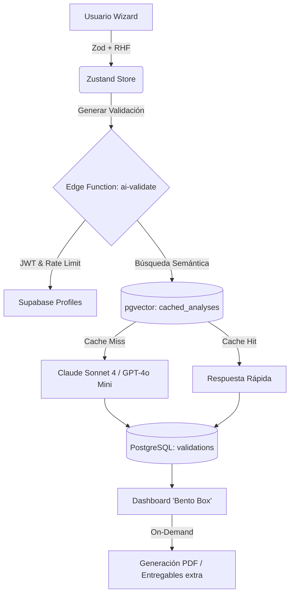

<div align="center">
  

  # ValidateAI
  
  **La plataforma SaaS definitiva para validar ideas de negocio con Inteligencia Artificial.**

  [](https://react.dev)
  [](https://vitejs.dev/)
  [](https://www.typescriptlang.org/)
  [](https://tailwindcss.com/)
  [](https://supabase.com/)
  [](https://www.anthropic.com/)
  [](https://vercel.com)

  [🌍 Ver en Producción](https://validateai-mu.vercel.app) •
  [📚 Documentación](#arquitectura-y-flujo-de-datos) •
  [🐛 Reportar Bug](#contribuir)
</div>

---

## 📖 Sobre el Proyecto

ValidateAI guía a emprendedores e inversores a través de un **wizard interactivo de 4 pasos**, generando una validación exhaustiva de ideas de negocio en minutos. Al finalizar, el sistema entrega un **Score (0-100)**, feedback cualitativo y hasta **18 entregables avanzados**, incluyendo:
- 📊 Análisis competitivo impulsado por *Web Search*.
- 💰 Proyecciones financieras (*Unit Economics*).
- 🧑‍🤝‍🧑 Análisis de *Founder-Market Fit*.
- 🗺️ Visualización interactiva 3D del mercado regional chileno.

---

## ⚡ Características Principales

- **🤖 Motor Multi-IA:** Optimizado con **Anthropic Claude Sonnet 4** (Prompt Caching) y fallback a **OpenAI GPT-4o Mini**.
- **🧠 Caché Semántico Inteligente:** Uso de `pgvector` para buscar y reutilizar análisis similares (Threshold: 0.92), reduciendo costos de API.
- **📈 Datos Macroeconómicos reales:** Integración con el **Banco Central de Chile** e **INE** para clasificaciones industriales y series económicas.
- **🎨 UX/UI Premium:** Diseño enfocado en la usabilidad ("Bento Box" Layout) con **Tailwind CSS v4** y animaciones fluidas con **Framer Motion**.
- **📑 Generación de Entregables:** Exportación de reportes a PDF on-demand con `jsPDF`.

---

## 🛠️ Stack Tecnológico

<details>
<summary>Haga clic para expandir la lista completa del Stack</summary>

### Frontend
- **Framework:** React 19 + Vite
- **Lenguaje:** TypeScript 6
- **Estilos:** Tailwind CSS v4 + shadcn/ui
- **Estado:** Zustand v5 (con persistencia local)
- **Enrutamiento:** React Router v7
- **Formularios:** React Hook Form + Zod
- **Visualización 3D:** Three.js + React Three Fiber + d3-geo
- **Gráficos:** Recharts

### Backend & Cloud (Supabase)
- **Base de Datos:** PostgreSQL + `pgvector`
- **Autenticación:** Supabase Auth (Email + Google OAuth con PKCE)
- **Serverless:** Edge Functions (Deno) para orquestación de IA y APIs externas.
- **Hosting:** Vercel

</details>

---

## 🚀 Inicio Rápido

### Requisitos Previos
- Node.js (v18+)
- Cuenta en [Supabase](https://supabase.com)
- Claves de API de [Anthropic](https://anthropic.com) y/o [OpenAI](https://openai.com)

### Instalación

1. **Clonar el repositorio e instalar dependencias:**
   ```bash
   git clone <repo-url>
   cd validateai
   npm install
   ```

2. **Configurar Variables de Entorno (Frontend):**
   ```bash
   cp .env.example .env.local
   ```
   Edita `.env.local` con tus credenciales de Supabase:
   ```env
   VITE_SUPABASE_URL=https://tu-proyecto.supabase.co
   VITE_SUPABASE_ANON_KEY=tu-anon-key
   ```

3. **Configurar Supabase Secrets (Backend):**
   ```bash
   supabase secrets set ANTHROPIC_API_KEY=tu-clave
   supabase secrets set OPENAI_API_KEY=tu-clave
   supabase secrets set AI_PROVIDER=anthropic # o 'openai'
   supabase secrets set BDE_USER=tu-usuario-bcch
   supabase secrets set BDE_PASS=tu-password-bcch
   ```

4. **Ejecutar en Desarrollo:**
   ```bash
   npm run dev
   ```

---

## 🏗️ Arquitectura y Flujo de Datos



### 🧠 Edge Functions Core

| Función | Descripción | Límites (Rate Limit) |
|---------|-------------|----------------------|
| `ai-validate` | Motor central de IA. Maneja 18 tipos de prompts, RAG y caché. | Según el **Tier** del usuario. |
| `market-analyze`| Ingiere datos macro del BCCh e INE para insights. | 10 llamadas / día. |
| `anonymize-idea`| Ofusca PII usando Claude Haiku para entrenar modelos. | 5 llamadas / día. |

### 💳 Sistema de Tiers (Niveles de Acceso)

El sistema de roles y rate limits está controlado desde la tabla `profiles`.

- **Free:** Score, desglose, preguntas clave y próximos pasos. (5 llamadas/día)
- **Basic:** + Segmento de cliente, propuesta de valor, análisis de riesgos. (20 llamadas/día)
- **Pro:** + MVP specs, Análisis FODA, Unit Economics, Founder-Market Fit. (50 llamadas/día)
- **Premium:** Acceso total (Señales de mercado, Competitive Analysis avanzado, kit de documentos). (200 llamadas/día)

---

## 🗄️ Esquema de Base de Datos

Las migraciones se gestionan a través del CLI de Supabase (`supabase/migrations/`).
*Para sincronizar el esquema local:* `supabase db push`

| Tabla Principal | Propósito |
|-----------------|-----------|
| `profiles` | Extensión de usuarios autenticados. Controla los `tiers` y consentimientos. |
| `validations` | Almacena los resultados del Wizard. Soporta versiones (pivotes). |
| `ai_interactions` | Logs de telemetría, tokens consumidos y modelos usados. |
| `cached_analyses` | Repositorio para el Caché Semántico (`pgvector`). |
| `competitors` | Base documental para el sistema RAG de análisis competitivo. |
| `market_ai_insights`| Resultados cacheados de series macroeconómicas. |

---

## 🛣️ Roadmap & Deuda Técnica

Para una vista detallada de los próximos sprints, revisa el documento [SPRINTS.md](SPRINTS.md).

**Prioridades Inmediatas:**
1. Integración de **Stripe Checkout** y webhooks para actualización automática de Tiers.
2. Implementación de analíticas de producto con **PostHog**.
3. Refactorización de la Edge Function `ai-validate` para desacoplar los 18 prompts y mejorar la mantenibilidad.

---

## 🤝 Contribuir

Este es un proyecto cerrado en etapa temprana. Para reportar bugs, solicitar nuevas características o proponer un *pull request*, por favor contacta al líder técnico o crea un Issue documentado en el repositorio.

<div align="center">
  <p>Creado con ❤️ por el equipo de ValidateAI.</p>
</div>
